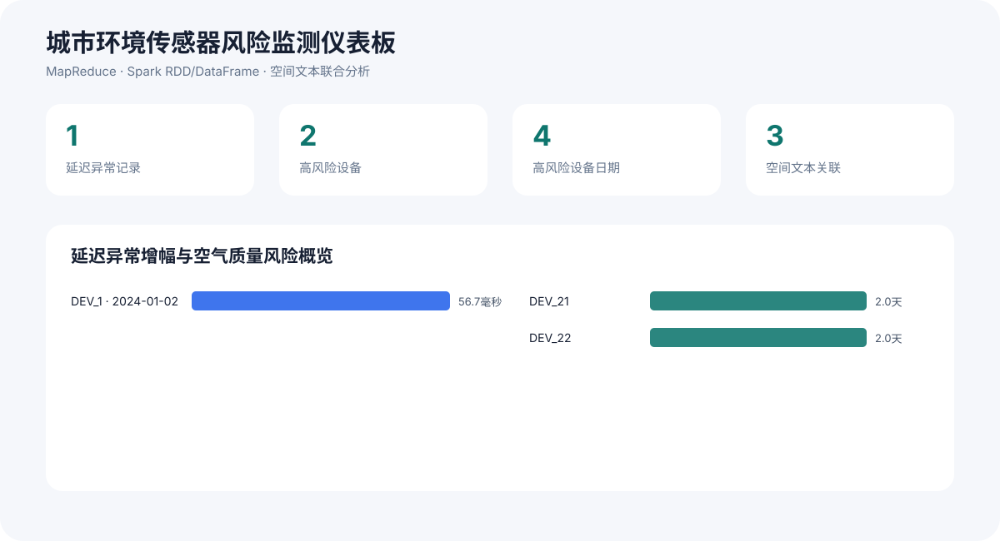

# 城市环境传感器风险监测系统

这是一个面向城市物联网场景的数据工程项目，用于发现设备延迟异常、评估空气质量风险，并将异常监测点与附近事件进行空间和文本联合匹配。项目把三个相互关联的课程作业整合为一套可运行、可测试、可视化的综合分析系统。



## 项目目标

城市传感器的异常通常不是单一维度的问题：空气质量高风险读数可能同时伴随设备通信延迟不稳定，也可能与附近发生的现实事件相关。本项目从三个角度完成联合分析：

1. **延迟稳定性分析**：比较设备每日平均延迟与设备长期平均延迟，检测显著增幅。
2. **空气质量风险分析**：按照设备和日期聚合 CO2、VOC 与 PM2.5 风险值。
3. **空间文本关联分析**：同时使用欧氏距离和杰卡德相似度关联监测点与周边事件。

仓库使用自行编写的实现与合成示例数据，不包含课程讲义、官方测试数据、评分脚本或私人提交文件。

## 系统架构

| 分析阶段 | 分布式技术 | 分析结果 |
|---|---|---|
| 设备延迟异常检测 | MRJob / Hadoop MapReduce | 设备每日延迟增幅 |
| 空气质量风险分析 | Spark RDD、Spark DataFrame | 高风险设备与日期排名 |
| 空间文本联合匹配 | Spark RDD | 监测点与周边事件关联 |
| 本地参考管线 | Python 标准库 | 中文 JSON 报告与可视化仪表板 |

详细处理过程见[系统架构说明](docs/系统架构.md)。

## 可视化功能

运行完整管线后会自动生成一个无需联网、可直接用浏览器打开的中文仪表板，其中包含：

- 延迟异常记录、高风险设备、高风险日期和空间文本关联四项总览指标；
- 设备延迟异常增幅横向条形图；
- 各设备高风险日期数量对比图；
- 监测点与周边事件的空间距离、文本相似度明细表；
- 适配电脑和手机屏幕的响应式布局。

默认生成文件：

- `output/分析报告.json`
- `output/可视化仪表板.html`
- `docs/仪表板预览.svg`

## 快速开始

本地参考管线只需要 Python 3.10 或更高版本：

```bash
python -m pip install -e .
sensor-analytics all
```

分别运行三个分析阶段：

```bash
sensor-analytics latency data/samples/latency.csv --threshold 20
sensor-analytics risk data/samples/air_quality.csv --threshold 2
sensor-analytics join data/samples/locations_a.txt data/samples/locations_b.txt \
  --distance 2 --similarity 0.5
```

查看中文命令帮助：

```bash
sensor-analytics --help
```

## 分布式作业

安装 MapReduce 与 Spark 运行依赖：

```bash
python -m pip install -r requirements-distributed.txt
```

通过 MRJob 在本地运行延迟异常检测：

```bash
python distributed/mapreduce_latency.py data/samples/latency.csv \
  --threshold 20 -r inline
```

运行 Spark 分析作业：

```bash
spark-submit distributed/spark_risk_rdd.py \
  data/samples/air_quality.csv output/风险分析-RDD 2

spark-submit distributed/spark_risk_dataframe.py \
  data/samples/air_quality.csv output/风险分析-DataFrame 2

spark-submit distributed/spark_spatial_text_join.py \
  data/samples/locations_a.txt data/samples/locations_b.txt \
  output/空间文本匹配 2 0.5
```

## 测试

```bash
python -m unittest discover -s tests -v
```

每次推送代码或创建拉取请求时，GitHub Actions 会自动运行单元测试、完整示例管线和可视化生成检查。

## 仓库结构

```text
data/samples/                  合成输入数据
distributed/                   MRJob 与 Spark 分布式实现
docs/                          中文架构说明和仪表板预览图
src/urban_sensor_analytics/    无外部依赖的参考管线、命令行工具和可视化模块
tests/                         数据解析与三个分析阶段的单元测试
```

## 技术栈

Python、Hadoop MapReduce、MRJob、Spark RDD、Spark DataFrame、HTML、CSS、SVG

## 开源许可

MIT
